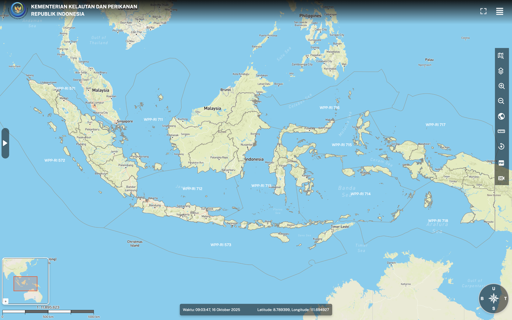
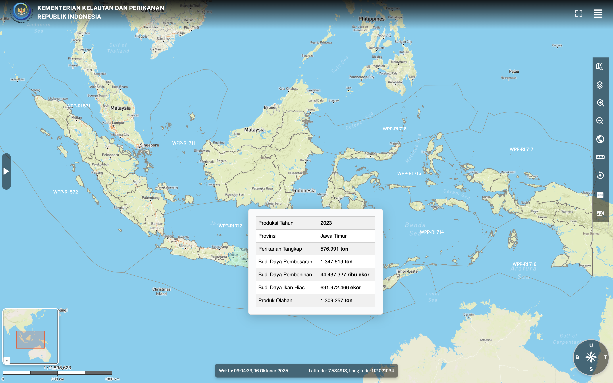
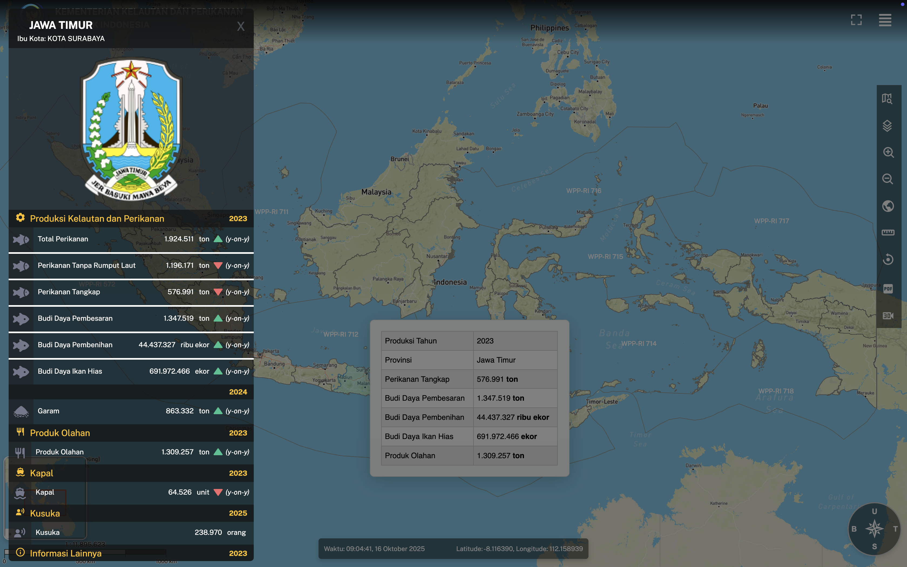
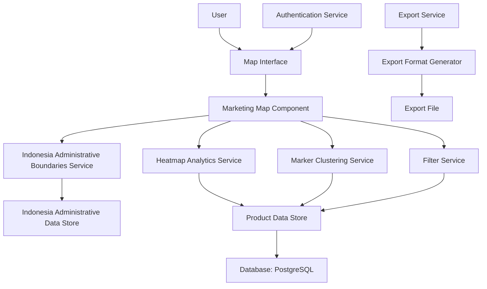

# Technical Design Document

## Interactive Marketing Maps for Indonesian Fertilization Industry

## Overview

This feature delivers interactive geographic data visualization capabilities for marketing professionals in the fertilization sector. The system enables users to visualize marketing data across Indonesia's administrative regions (national, provincial, and regency levels), with heatmap analytics based on land types, commodity types, and various fertilization products. The feature integrates with the existing Marketing Maps platform to provide specialized fertilization industry analytics.

Users in the fertilization industry (marketing professionals, analysts, managers, and directors) will utilize this for monitoring distribution patterns, identifying regions with high fertilization needs, and analyzing performance across different types of fertilization products (Urea, NPK, Petroganik, etc.) at various administrative levels in Indonesia. The products are categorized using the ProductType and ProductBrand entities from the existing database schema.

The feature changes the current system state by adding specialized mapping functionality that was not previously available for fertilization-specific analytics, creating new data visualization capabilities within the existing map route structure.

## Visual Design Reference

The following visual assets provide reference for the intended user interface and interaction patterns:

- **Main View**:  - Shows the primary map visualization interface
- **Hover Interactions**:  - Demonstrates the visual feedback when hovering over map elements
- **Click Interactions**:  - Illustrates the behavior when clicking on map elements

These visual references guide the implementation of the interactive marketing maps, ensuring consistency with the intended user experience and visual design.

### UI Design Requirements

Based on the visual references, the following UI elements must be implemented:

- **Main Map Interface**: Full-screen map display with Indonesia as the focus area
- **Control Panel**: Overlay panel with filtering controls, product type selectors, and administrative level selectors
- **Hover Effects**: Visual highlighting of regions and markers when hovered with tooltips showing key information
- **Click Interactions**: Detailed information panels that appear when a region or marker is clicked
- **Legend Panel**: Color-coded legend for heatmaps with corresponding values
- **Toolbar**: Map controls (zoom in/out, reset view, etc.) positioned appropriately on the screen

### Goals

- Enable visualization of fertilization marketing data across Indonesia's administrative regions
- Provide heatmap analytics for different product types, product brands, land types, and commodity types
- Implement filtering capabilities by product types, product brands, land types, commodity types, and time periods
- Maintain system performance with efficient marker clustering for large datasets

### Non-Goals

- Real-time data visualization (page refreshes will be sufficient)
- Integration with external weather or agricultural data sources
- Mobile app implementation (focus on web application)
- Full CRUD operations for fertilization data (view-only functionality)

## Architecture

### Existing Architecture Analysis

The current Marketing Maps application follows Clean Architecture principles with feature-based organization, using the existing `apps/web/src/routes/map/` directory structure. The architecture uses React 19.1.1 with TanStack Router for routing, TypeScript for type safety, Zod for validation, and Drizzle ORM for database operations. The application uses Leaflet for mapping functionality with heatmap and marker cluster plugins.

### High-Level Architecture



### Technology Alignment

- **Frontend Framework**: React 19.1.1 with TypeScript 5.9.2 - continues existing pattern
- **Routing**: TanStack Router - maintains existing routing architecture
- **Maps**: Leaflet with heatmap and marker cluster plugins - leverages existing mapping technology
- **Database**: PostgreSQL with Drizzle ORM - continues existing database stack
- **API**: oRPC for type-safe API contracts - maintains existing API approach
- **UI Components**: shadcn/ui with Tailwind CSS - follows existing UI patterns
- **Authentication**: Better Auth - maintains existing auth system

### Key Design Decisions

**Decision**: Use server-side pagination with client-side clustering for large datasets

- **Context**: Need to efficiently display large numbers of product data points without performance issues
- **Alternatives**: Client-side only pagination, server-side clustering, real-time streaming
- **Selected Approach**: Fetch paginated data from server and use client-side marker clustering
- **Rationale**: Reduces initial load on client while still providing good performance and clustering capabilities
- **Trade-offs**: Trade-off is slightly more complex initial loading but better overall performance with large datasets

**Decision**: Implement static administrative boundaries for Indonesia

- **Context**: Need to display Indonesia's national, provincial, regency, and district boundaries
- **Alternatives**: Dynamic boundary loading, external boundary service, simplified boundaries
- **Selected Approach**: Pre-load static GeoJSON boundaries for Indonesia's administrative regions
- **Rationale**: Ensures consistent, fast loading of boundaries without external dependencies
- **Trade-offs**: Increases initial bundle size but provides better performance and reliability

**Decision**: Use Zod schemas for data validation and type safety

- **Context**: Need to ensure data integrity and type safety when fetching product data
- **Alternatives**: TypeScript interfaces only, runtime validation libraries, manual validation
- **Selected Approach**: Zod schemas for both runtime validation and TypeScript type inference
- **Rationale**: Maintains consistency with existing application approach and provides end-to-end type safety
- **Trade-offs**: Slight overhead in bundle size but ensures data integrity and catches type errors early

## Components and Interfaces

### Map Visualization Layer

#### Marketing Map Component

**Responsibility & Boundaries**

- **Primary Responsibility**: Renders interactive map with product marketing data, administrative boundaries, and heatmap analytics
- **Domain Boundary**: Product marketing visualization domain
- **Data Ownership**: Map state including zoom level, center coordinates, active layers, and filters
- **Transaction Boundary**: Not applicable (UI component)

**Dependencies**

- **Inbound**: Dashboard, export functions, filter UI components
- **Outbound**: Administrative Boundaries Service, Heatmap Analytics Service, Marker Clustering Service, Filter Service
- **External**: Leaflet, Leaflet plugins (heatmap, marker cluster), GeoJSON for Indonesia boundaries

**Contract Definition**

**React Component Interface**:

```typescript
interface MarketingMapProps {
  productData: ProductData[];
  administrativeLevel: AdministrativeLevel;
  selectedProductBrand?: ProductBrand;
  filters: FilterCriteria;
  onMapViewChange: (viewState: MapViewState) => void;
  onProductBrandChange: (brand: ProductBrand) => void;
  onAdministrativeLevelChange: (level: AdministrativeLevel) => void;
}

interface MapViewState {
  center: [number, number]; // [latitude, longitude]
  zoom: number;
}

type AdministrativeLevel = "national" | "province" | "regency";
type ProductBrand = "Urea" | "NPK" | "Petroganik" | "Other";
```

### Data Services Layer

#### Administrative Boundaries Service

**Responsibility & Boundaries**

- **Primary Responsibility**: Provide GeoJSON boundaries for Indonesia's administrative regions at different levels
- **Domain Boundary**: Geographic data domain
- **Data Ownership**: Static administrative boundary data for Indonesia
- **Transaction Boundary**: Not applicable (stateless service)

**Dependencies**

- **Inbound**: Marketing Map Component
- **Outbound**: None
- **External**: GeoJSON files for Indonesia boundaries

**Contract Definition**

**Service Interface**:

```typescript
interface AdministrativeBoundariesService {
  getBoundaries(level: AdministrativeLevel): Promise<GeoJSON.FeatureCollection>;
  getBoundaryById(
    level: AdministrativeLevel,
    id: string
  ): Promise<GeoJSON.Feature | null>;
  getAllBoundariesForLevel(level: AdministrativeLevel): Promise<string[]>;
}

type AdministrativeLevel = "national" | "province" | "regency";
```

#### Heatmap Analytics Service

**Responsibility & Boundaries**

- **Primary Responsibility**: Generate heatmaps based on product data and selected visualization parameters
- **Domain Boundary**: Analytics and visualization domain
- **Data Ownership**: Processes product data for heatmap generation
- **Transaction Boundary**: Not applicable (stateless service)

**Dependencies**

- **Inbound**: Marketing Map Component
- **Outbound**: Product Data Store (via oRPC)
- **External**: Leaflet Heatmap plugin

**Contract Definition**

**Service Interface**:

```typescript
interface HeatmapAnalyticsService {
  generateHeatmap(
    data: ProductData[],
    options: HeatmapOptions
  ): Promise<HeatmapResult>;

  getAvailableHeatmapTypes(): Promise<HeatmapType[]>;
}

interface HeatmapOptions {
  type: HeatmapType;
  administrativeLevel: AdministrativeLevel;
  productBrand?: ProductBrand;
  timeRange?: DateRange;
}

type HeatmapType =
  | "demand-density"
  | "distribution-pattern"
  | "product-need";
```

#### Marker Clustering Service

**Responsibility & Boundaries**

- **Primary Responsibility**: Cluster product data points for efficient rendering at different zoom levels
- **Domain Boundary**: Visualization performance domain
- **Data Ownership**: Manages clustering state and algorithms
- **Transaction Boundary**: Not applicable (stateless service)

**Dependencies**

- **Inbound**: Marketing Map Component
- **Outbound**: Product Data Store (via oRPC)
- **External**: Leaflet Marker Cluster plugin

**Contract Definition**

**Service Interface**:

```typescript
interface MarkerClusteringService {
  clusterData(
    data: ProductData[],
    bounds: MapBounds,
    zoom: number
  ): Promise<ClusteredData>;

  updateClusters(
    currentClusters: ClusteredData,
    newData: ProductData[]
  ): Promise<ClusteredData>;
}

interface MapBounds {
  northEast: [number, number];
  southWest: [number, number];
}

interface ClusteredData {
  clusters: Cluster[];
  points: ProductPoint[];
}

interface Cluster {
  id: string;
  position: [number, number];
  count: number;
  data: ProductData[];
}

interface ProductPoint {
  id: string;
  position: [number, number];
  data: ProductData;
}
```

### Data Access Layer

#### Filter Service

**Responsibility & Boundaries**

- **Primary Responsibility**: Handle filtering of product data based on user criteria
- **Domain Boundary**: Data processing and filtering domain
- **Data Ownership**: Maintains filter state and validation
- **Transaction Boundary**: Not applicable (stateless service)

**Dependencies**

- **Inbound**: Marketing Map Component, Filter UI components
- **Outbound**: Product Data Store (via oRPC)
- **External**: None

**Contract Definition**

**Service Interface**:

```typescript
interface FilterService {
  applyFilters(
    data: ProductData[],
    criteria: FilterCriteria
  ): Promise<ProductData[]>;

  validateFilterCriteria(criteria: FilterCriteria): Promise<ValidationResult>;
}

interface FilterCriteria {
  productTypes?: ProductType[];
  productBrands?: ProductBrand[];
  landTypes?: LandType[];
  commodityTypes?: CommodityType[];
  timeRange?: DateRange;
  administrativeRegion?: string; // ID of specific region
}

interface ValidationResult {
  isValid: boolean;
  errors: string[];
}
```

## Data Models

### Domain Model

**Core Concepts**:

**MarketingData Aggregate**:

- **MarketingData Entity**: Represents marketing data for product analytics
  - Properties: derived from province_potentials/regency_potentials, product_brand_id, land_type_id, commodity_type_id
  - Identity: Based on the underlying potential/commodity data
  - Lifecycle: Derived from existing potential and commodity tables

**AdministrativeRegion Entity**: Represents an Indonesian administrative boundary

- Properties: id, name, level (province/regency), geometry data file reference
- Identity: Administrative code/ID
- Lifecycle: Static data loaded from existing GeoJSON files

**Value Objects**:

- **DateRange**: start and end dates for time-based filters
- **ProductParameters**: Type, quantity, and application metrics

### Logical Data Model

**Entity Relationships**:

- MarketingData (1) -> (\*) Provinces/Regencies (many marketing records per administrative region)
- MarketingData includes references to product types, product brands, land types and commodity types through existing foreign key relationships

**Attributes**:

- MarketingData: derived from province_potentials/regency_potentials tables
  - productBrandId (UUID) -> references product_brands
  - productTypeId (UUID) -> references product_types
  - landTypeId (UUID) -> references land_types
  - commodityTypeId (UUID) -> references commodity_types
  - potential/area values from existing tables
- AdministrativeRegion: id (UUID), name (string), level (enum: province/regency), code (string for GeoJSON file reference)
- ProductType: enum of possible product types (Pupuk PSO, Probiotik, Dekomposer)
- ProductBrand: enum of possible product brands (Urea, Petroganik, Petrofish)
- LandType: enum of possible land types (Pangan, Kebun, Horti, Tambak)
- CommodityType: enum of possible commodity types (Padi, Sawit, Bawang Merah, etc.)

### Physical Data Model

**Database Tables** (aligned with existing schema):

**Existing tables from map_product.ts**:

- provinces: id, code, name, area, created_at, updated_at
- regencies: id, code, province_id (FK), name, area, created_at, updated_at
- land_types: id, name, created_at, updated_at
- province_lands: id, province_id (FK), land_type_id (FK), area, created_at, updated_at
- regency_lands: id, regency_id (FK), land_type_id (FK), area, created_at, updated_at
- commodity_types: id, land_type_id (FK), name, created_at, updated_at
- province_commodities: id, province_id (FK), commodity_type_id (FK), area, created_at, updated_at
- regency_commodities: id, regency_id (FK), commodity_type_id (FK), area, created_at, updated_at
- product_types: id, name, description, created_at, updated_at
- product_brands: id, product_type_id (FK), name, industry, description, created_at, updated_at
- product_dosages: id, commodity_type_id (FK), product_brand_id (FK), dosage, unit, created_at
- province_potentials: id, province_id (FK), product_brand_id (FK), potential, description, created_at, updated_at
- regency_potentials: id, regency_id (FK), product_brand_id (FK), potential, description, created_at, updated_at

**Additional tables needed for marketing maps**:

- districts: id, regency_id (FK), name, area, created_at, updated_at (to complete national hierarchy)

**Data for heatmap analytics**:

- Marketing maps data will be derived from existing tables: province_lands, regency_lands, province_commodities, regency_commodities, province_potentials, regency_potentials
- No new marketing data table is needed as data is already available in existing schema

**Integration with existing GeoJSON data**:

- GeoJSON files in `/src/lib/data/provinces/` and `/src/lib/data/regencies/` will be referenced by administrative codes
- File names follow the format: `province_code.geojson` and `regency_code.geojson`

## Error Handling

### Error Strategy

- **User Errors**: Invalid filters, unavailable data, unauthorized access
- **System Errors**: Database connection failures, map loading errors
- **Business Logic Errors**: Invalid administrative region, unsupported product type

### Error Categories and Responses

**User Errors**:

- Invalid input → field-level validation with clear error messages
- Unauthorized → redirect to login with appropriate messaging
- Data not found → display empty state with guidance to adjust filters

**System Errors**:

- Database failures → graceful degradation, cached data if available
- Map service failures → display error message with retry option
- Boundary data loading errors → fallback to simplified map view

**Business Logic Errors**:

- Invalid administrative level → validation error with valid options
- Unsupported product brand → validation error with valid options
- Out-of-range dates → validation error with acceptable date range

### Monitoring

- Track map load times and performance metrics
- Monitor error rates and user interactions
- Log boundary loading failures and heatmap generation issues

## Testing Strategy

### Unit Tests

- Product data validation functions
- Filter service logic and criteria validation
- Administrative boundary lookup functions
- Heatmap generation algorithms

### Integration Tests

- oRPC endpoints for product data retrieval
- Database queries with filtering and pagination
- Map component with mock data services
- Authentication and authorization flows

### E2E/UI Tests

- User journey: select region → view heatmap → apply filters → export data
- Administrative level switching (national to provincial to regency)
- Product brand selection and visualization changes
- Data export functionality

### Performance Tests

- Map rendering performance with large datasets
- Heatmap generation time with different data volumes
- Boundary loading performance across different administrative levels
- Filter application responsiveness

## Security Considerations

### Authentication and Authorization

- User must be authenticated to access product marketing data
- Role-based access control for different levels of data visibility
- Protection against unauthorized access to sensitive marketing data

### Data Protection

- Product marketing data is sensitive business information
- Implement data anonymization for aggregate views
- Ensure compliance with data privacy regulations

### Input Validation

- All filter parameters must be validated to prevent injection attacks
- Location data must be validated to prevent malicious coordinates
- Administrative region IDs must be validated against known boundaries
